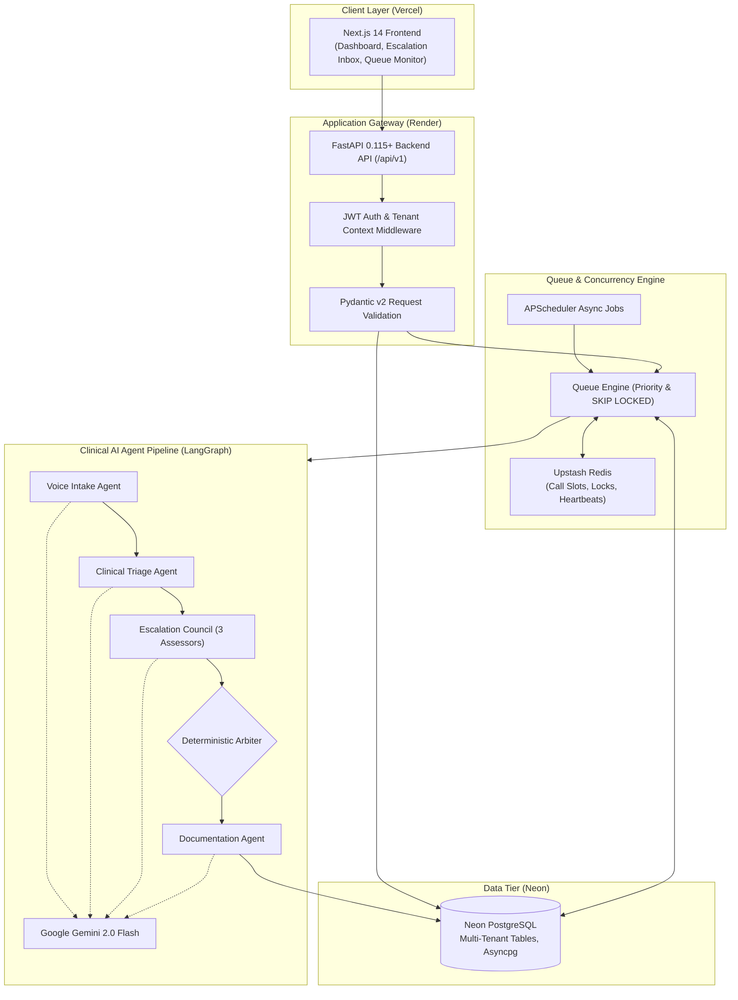
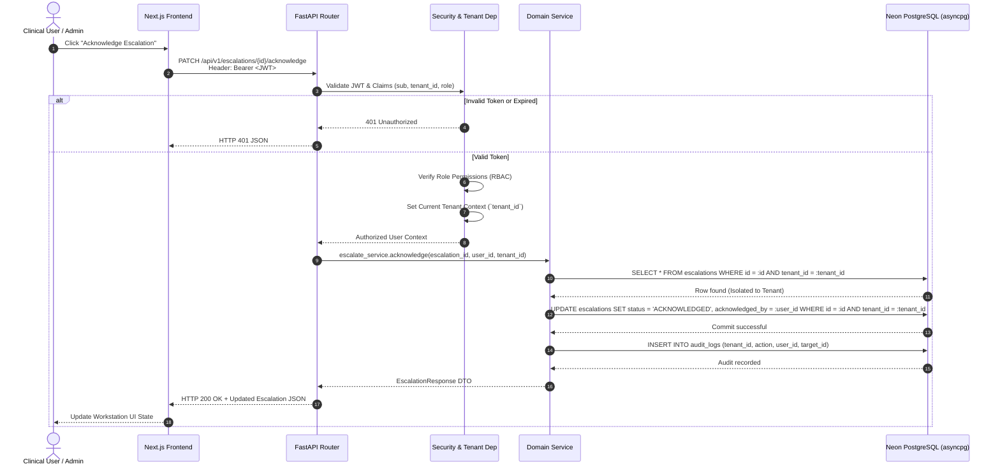
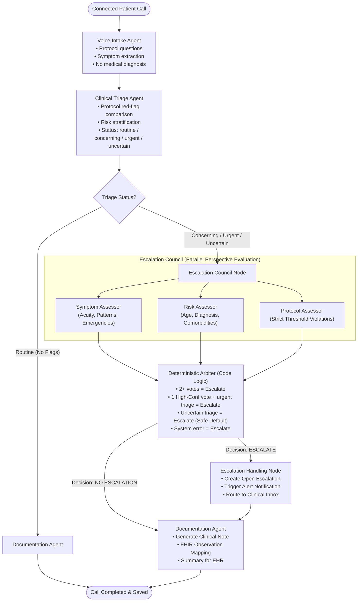
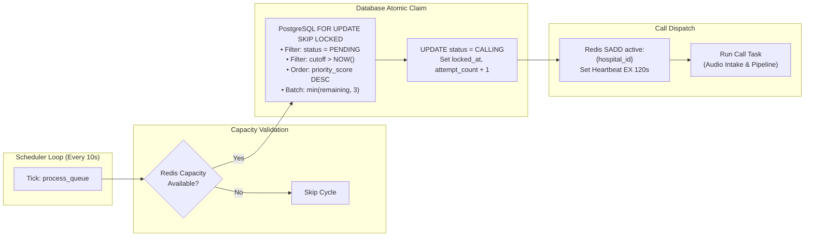
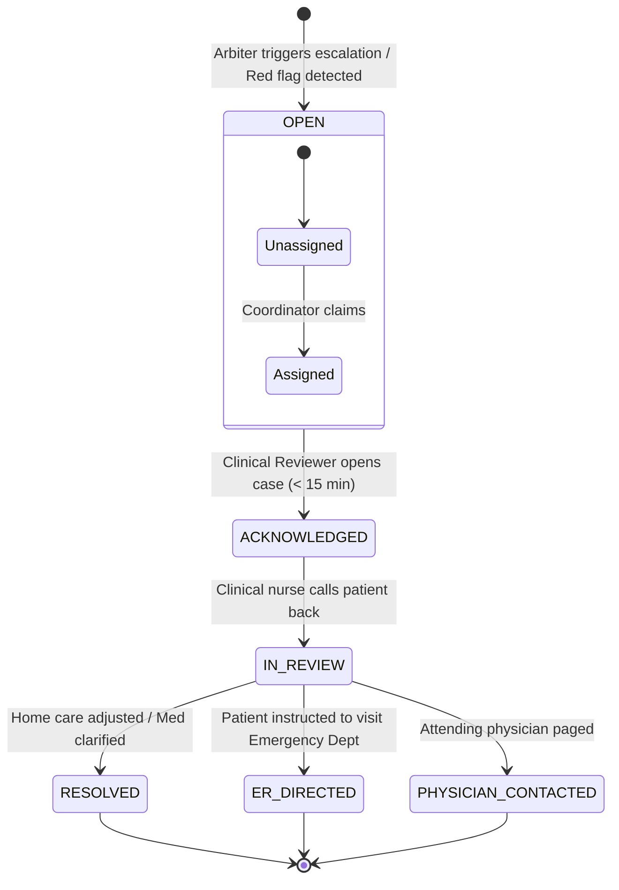
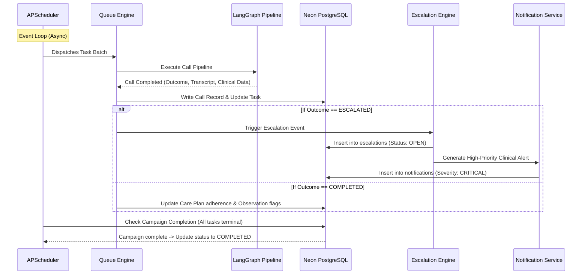

# Architecture Documentation

## System Architecture

The Multi-Hospital Post-Discharge Outreach Platform is a cloud-native, multi-tenant healthcare SaaS application engineered to automate post-discharge patient outreach, conduct AI-driven clinical symptom intake, detect post-acute complications, and escalate high-risk cases to human clinical teams within clinical protocol windows.

```
┌─────────────────────────────────────────────────────────────────────────────┐
│                             PRESENTATION LAYER                              │
│  Next.js 14 App Router | React Query | Tailwind CSS | TypeScript (Vercel)   │
│  - Hospital Admin Portal     - Clinical Review Workstation                  │
│  - Campaign Management UI    - Live Queue & Escalation Monitor              │
└──────────────────────────────────────┬──────────────────────────────────────┘
                                       │ HTTPS / WSS / JWT
                                       ▼
┌─────────────────────────────────────────────────────────────────────────────┐
│                              API GATEWAY LAYER                              │
│             FastAPI 0.115+ (Render / Containerized / Uvicorn)               │
│  - JWT Authentication Middleware    - Multi-Tenant Isolation Context        │
│  - Pydantic v2 Schema Validation    - Rate Limiting & Audit Interceptors    │
└──────────────────────┬───────────────────────────────┬──────────────────────┘
                       │                               │
       Database & ORM  │               Redis State     │ AI Orchestration
                       ▼                               ▼
┌──────────────────────────────┐     ┌────────────────────────────────────────┐
│     DATA & PERSISTENCE       │     │          DISTRIBUTED CACHE             │
│  Neon PostgreSQL (Serverless)│     │         Upstash Redis (REST)           │
│  - Async SQLAlchemy 2.0      │     │  - active:{hospital_id} Call Slots     │
│  - asyncpg Driver Pool       │     │  - Heartbeat & Worker Leases (120s)    │
│  - Row-Level Tenant Indexing │     │  - Idempotency Locks (SET NX)          │
│  - FOR UPDATE SKIP LOCKED    │     │  - Real-Time Metric Aggregates         │
└──────────────────────────────┘     └────────────────────────────────────────┘
                       ▲                               ▲
                       │                               │
┌──────────────────────┴───────────────────────────────┴──────────────────────┐
│                           ASYNC BACKGROUND ENGINE                           │
│                     APScheduler in FastAPI Process                          │
│  - Queue Dispatcher (10s)         - Retry Processor (30s)                   │
│  - Callback Activator (30s)       - Stuck Task Recovery (60s)               │
│  - Clinical Cutoff Monitor (60s)  - Campaign Lifecycle Manager (30s)        │
└──────────────────────────────────────┬──────────────────────────────────────┘
                                       │
                                       ▼
┌─────────────────────────────────────────────────────────────────────────────┐
│                          CLINICAL AI AGENT SYSTEM                           │
│                   LangGraph + Google Gemini 2.0 Flash                       │
│  - Voice Intake Node (Protocol questions & empathetic symptom collection)   │
│  - Clinical Triage Node (Protocol red-flag matching & severity scoring)     │
│  - Escalation Council (3 Independent Assessors: Symptoms, Risk, Protocol)   │
│  - Deterministic Arbiter (Code-based majority & conservative safety logic)  │
│  - Documentation Node (Clinical summary, EHR coding, FHIR observations)     │
└─────────────────────────────────────────────────────────────────────────────┘
```

---

## Architectural Diagrams

### 1. Overall System Architecture Diagram



### 2. Request Flow (User → API → Auth → Tenant → Service → DB)



### 3. AI Agent Pipeline (Intake → Triage → Council → Arbiter → Documentation)



### 4. Queue Processing Flow



### 5. Escalation Workflow



---

## Technology Decisions

| Layer | Choice | Rejected Alternatives | Architectural Rationale |
|---|---|---|---|
| **API Framework** | **FastAPI** | Flask, Django REST Framework, Express.js | Native async/await support for high-concurrency I/O, automated OpenAPI/Swagger generation, deep integration with Pydantic v2 type safety, and microsecond response latencies. |
| **Persistence Database** | **Neon PostgreSQL** | AWS RDS, MongoDB, DynamoDB | Serverless branching and autoscaling, native PostgreSQL support for ACID transactions, robust row-level relational isolation, and `FOR UPDATE SKIP LOCKED` for reliable queue locking. |
| **Database Driver & ORM** | **SQLAlchemy 2.0 (Mapped) + asyncpg** | Prisma, Tortoise ORM, Raw psycopg2 | Modern type-safe `mapped_column` declarations, complete async dialect compatibility with asyncpg, enterprise connection pooling, and fine-grained raw SQL execution when needed. |
| **Distributed Cache & Locking** | **Upstash Redis** | Local in-memory dict, Memcached, Self-hosted Redis | Serverless HTTP/REST compatibility eliminates persistent connection pool exhaustion in serverless or auto-scaled containers; sub-millisecond atomic sets and keyspace TTLs. |
| **AI Orchestration** | **LangGraph** | AutoGen, CrewAI, Raw Prompts | Graph-based deterministic state machine with conditional routing, checkpointing, node-level error boundaries, and explicit human-in-the-loop support. |
| **Foundational LLM** | **Google Gemini 2.0 Flash** | GPT-4o, Claude 3.5 Sonnet, Local Llama 3 | Industry-leading inference speed (< 800ms time-to-first-token), native JSON mode enforcement, 1M context window, and competitive price-performance for clinical throughput. |
| **Background Scheduler** | **APScheduler (AsyncIO)** | Celery + RabbitMQ, Temporal, AWS SQS | Eliminates operational overhead of running separate worker clusters and message brokers during prototype and mid-scale deployments; runs cleanly within the FastAPI async event loop. |
| **Frontend Framework** | **Next.js 14 (App Router)** | Vite + React SPA, Remix, Nuxt | Server-side rendering (SSR), optimized bundle delivery, Edge API middleware, and standard deployment on Vercel. |

---

## Multi-Tenancy Architecture

The platform provides strict multi-hospital isolation across shared cloud compute and storage infrastructure.

### 1. Row-Level Tenant Isolation
Every database table containing patient, campaign, clinical, or operational data includes a non-nullable indexed column:
```sql
tenant_id UUID NOT NULL REFERENCES hospitals(id) ON DELETE CASCADE
CREATE INDEX ix_tablename_tenant_id ON tablename (tenant_id);
```

### 2. Query-Level Tenant Filtering
No API endpoint is permitted to execute unfiltered queries. Database interactions enforce tenant context through FastAPI dependency injection:
```python
# In backend/app/core/tenant.py
async def get_current_tenant(
    current_user: User = Depends(get_current_user)
) -> str:
    if not current_user.tenant_id:
        raise HTTPException(status_code=400, detail="User has no tenant association")
    return str(current_user.tenant_id)
```
Every SQLAlchemy statement strictly scopes by this tenant context:
```python
stmt = select(Patient).where(
    Patient.tenant_id == tenant_id,
    Patient.id == patient_id
)
```

### 3. JWT Claims Context
Authentication tokens encode tenant identity:
```json
{
  "sub": "usr_94a2e817b3",
  "email": "nurse.sarah@metrohealth.org",
  "tenant_id": "hosp_883e1c2a",
  "hospital_id": "hosp_883e1c2a",
  "role": "clinical_reviewer",
  "exp": 1758200000
}
```
Platform administrators with `role = "platform_admin"` can switch hospital context via an explicit `X-Tenant-ID` header, which is logged to `audit_logs`.

---

## Data Model & Entity Specifications

The platform persistence layer comprises 15 relational tables in Neon PostgreSQL:

```
hospitals (1) ───────────< users (N)
   │
   ├─────────────────────< clinical_protocols (N)
   ├─────────────────────< campaigns (N) ───────────< outreach_tasks (N) ───< call_records (N)
   │                                                         │                     │
   ├─────────────────────< patients (N) ─────────────────────┤                     ├──< escalations (N)
   │                          │                              │                     │
   │                          ├──< encounters (N) ───────────┘                     └──< communications (N)
   │                          ├──< observations (N)
   │                          └──< care_plans (N)
   │
   ├─────────────────────< notifications (N)
   ├─────────────────────< audit_logs (N)
   └─────────────────────< ai_request_logs (N)
```

### Table Schema Summary

1. **`hospitals`**: Tenant profile (name, code, max_concurrent_calls, calling_hours_start, calling_hours_end, timezone, is_active).
2. **`users`**: Platform users (email, hashed_password, full_name, role, tenant_id, is_active).
3. **`patients`**: Patient master index (tenant_id, mrn, first_name, last_name, phone_number, date_of_birth, risk_level, preferred_language).
4. **`encounters`**: Clinical inpatient stays (tenant_id, patient_id, encounter_type, admission_date, discharge_date, primary_diagnosis, attending_physician).
5. **`observations`**: Clinical vitals and lab values (tenant_id, patient_id, encounter_id, code, display, value, unit, effective_datetime).
6. **`care_plans`**: Post-discharge regimens (tenant_id, patient_id, encounter_id, instructions, medications, follow_up_appointments).
7. **`clinical_protocols`**: Hospital-specific triage rules (tenant_id, diagnosis_category, red_flag_symptoms, escalation_indicators, follow_up_questions, approved_guidance).
8. **`campaigns`**: Outreach batches (tenant_id, name, target_condition, start_date, end_date, clinical_cutoff_hours, status, total_patients, total_completed, total_escalated).
9. **`outreach_tasks`**: Queue work items (tenant_id, campaign_id, patient_id, encounter_id, status, priority_score, attempt_count, max_retries, clinical_cutoff_at, next_retry_at, callback_requested_at, locked_at, locked_by, idempotency_key).
10. **`call_records`**: Call attempts and transcripts (tenant_id, task_id, campaign_id, patient_id, attempt_number, status, outcome, start_time, end_time, duration_seconds, transcript, ai_outputs, triage_result, escalation_decision).
11. **`escalations`**: Triggered clinical alerts (tenant_id, patient_id, campaign_id, call_record_id, priority, trigger, clinical_indicators, triage_result, consensus_result, status, acknowledged_at, acknowledged_by, resolution_notes).
12. **`communications`**: Omnichannel log (tenant_id, patient_id, type, direction, status, recipient, content, sent_at).
13. **`notifications`**: In-app clinical alerts (tenant_id, user_id, title, message, severity, read, link).
14. **`audit_logs`**: Regulatory access audit (tenant_id, user_id, action, resource_type, resource_id, details, ip_address, timestamp).
15. **`ai_request_logs`**: LLM token and cost telemetry (tenant_id, agent_name, model, prompt_tokens, completion_tokens, latency_ms, estimated_cost_usd, status).

---

## API Design & Standards

All endpoints follow RESTful conventions under the `/api/v1` prefix.

### Core Architectural Standards
- **Strict Pydantic v2**: All payloads validated using `model_validate` and `ConfigDict(from_attributes=True)`.
- **Standardized Pagination**:
  ```json
  {
    "items": [...],
    "total": 142,
    "page": 1,
    "page_size": 20,
    "pages": 8
  }
  ```
- **Consistent Error Structure**:
  ```json
  {
    "error": {
      "code": "TASK_NOT_FOUND",
      "message": "Outreach task with ID 4f9e8a does not exist for this hospital",
      "details": { "task_id": "4f9e8a" }
    }
  }
  ```

### API Endpoint Registry

| Domain | Method | Endpoint | Description |
|---|---|---|---|
| **Auth** | `POST` | `/api/v1/auth/token` | Exchange credentials for OAuth2 JWT |
| **Auth** | `GET` | `/api/v1/auth/me` | Retrieve authenticated user profile and roles |
| **Hospitals**| `GET` | `/api/v1/hospitals/me` | Get active hospital configuration and capacity |
| **Campaigns**| `GET` | `/api/v1/campaigns` | List hospital campaigns with metrics |
| **Campaigns**| `POST` | `/api/v1/campaigns` | Create and initialize a new outreach cohort |
| **Campaigns**| `POST` | `/api/v1/campaigns/{id}/start` | Activate campaign and register with queue |
| **Queue** | `GET` | `/api/v1/queue/metrics` | Real-time queue gauges (pending, calling, retries) |
| **Queue** | `POST` | `/api/v1/queue/dispatch` | Manual trigger for queue processing cycle |
| **Escalations**| `GET` | `/api/v1/escalations` | Filter active clinical escalations by priority |
| **Escalations**| `PATCH`| `/api/v1/escalations/{id}/acknowledge` | Clinical user acknowledges escalation |
| **Escalations**| `POST` | `/api/v1/escalations/{id}/resolve` | Resolve escalation with clinical action note |
| **Patients** | `GET` | `/api/v1/patients` | Search patients, view EHR history & care plans |
| **EHR** | `POST` | `/api/v1/ehr/sync` | Ingest FHIR / HL7 discharge records |

---

## Authentication & Role-Based Access Control (RBAC)

The platform supports four hierarchical roles:

| Role | Scope | Permissions |
|---|---|---|
| **`platform_admin`** | Global (Cross-Tenant) | Manage hospital onboarding, global LLM configurations, system health monitoring, cross-tenant auditing. |
| **`hospital_admin`** | Hospital Tenant | Manage hospital staff users, configure calling hours, set concurrency limits, edit clinical protocols. |
| **`campaign_manager`**| Hospital Tenant | Ingest patient discharge rosters, configure campaigns, schedule outreach windows, view campaign analytics. |
| **`clinical_reviewer`**| Hospital Tenant | Access escalation inbox, review call transcripts and audio, acknowledge clinical alerts, resolve escalations. |

---

## Event-Driven Architecture & Lifecycle Operations

The platform uses an event-driven scheduler topology powered by APScheduler running inside the FastAPI process, keeping operations lightweight and self-contained:



This ensures that critical clinical events propagate immediately to human clinicians while routine follow-up tasks document cleanly into the patient's record.
