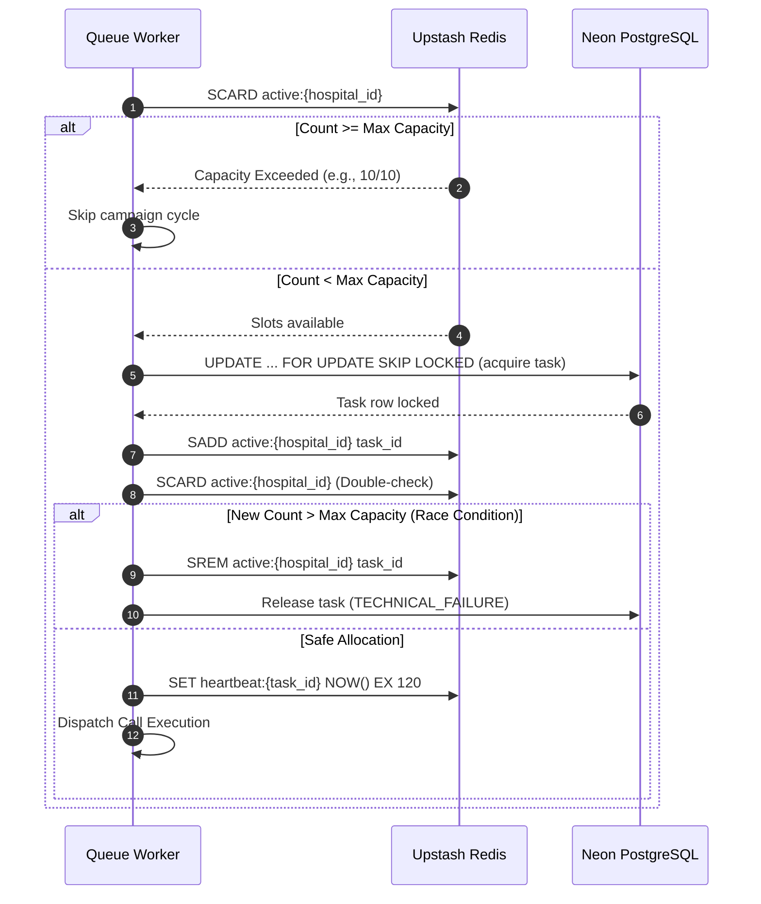

# Outbound Call Queue Design Document

## Overview

The Outbound Call Queue is the core operational engine of the Multi-Hospital Post-Discharge Outreach Platform. In a post-discharge environment, clinical follow-up is severely constrained by real-world physical and clinical realities:
1. **Limited Call Concurrency**: Hospitals have finite telephonic trunk capacity and clinical reviewer bandwidth to handle simultaneous active connections (typically 5–20 concurrent calls per facility).
2. **Strict Clinical Follow-Up Windows**: Hospital discharge protocols define critical windows (e.g., within 24 to 72 hours post-discharge) during which outreach must occur to reduce readmissions, detect surgical complications, and prevent adverse drug events.
3. **Dynamic Patient Acuity**: A patient discharged following coronary artery bypass graft (CABG) surgery has a fundamentally different clinical urgency profile than a patient discharged after an elective orthopedic procedure.
4. **Anti-Starvation and Aging Needs**: Without balanced queue dynamics, low-acuity patients could be perpetually delayed ("starved") until their clinical window expires, triggering regulatory non-compliance.

The queue engine coordinates call dispatching, rate limiting, retry backoff calculations, clinical cutoff enforcement, callback handling, and stuck-task recovery across multiple isolated hospital tenants while optimizing for patient safety and clinical compliance.

---

## Queue State Machine

The lifecycle of an outreach task follows a deterministic state machine designed to ensure that every patient attempt is tracked, auditable, and resilient to worker or network interruptions.

```
PENDING ───────────→ CALLING ───────────→ CONNECTED ───────────→ COMPLETED
                       │                       │
                       │                       └───────────────→ ESCALATED (terminal)
                       │
                       ├───────────────→ NO_ANSWER ──────────┐
                       ├───────────────→ BUSY ───────────────┤
                       ├───────────────→ VOICEMAIL ──────────┼──→ RETRY_SCHEDULED ──→ PENDING
                       ├───────────────→ DROPPED ────────────┤         (backoff wait)   (next_retry_at arrives)
                       │                                     │
                       ├───────────────→ INVALID_NUMBER ─────┼──→ MANUAL_FOLLOW_UP
                       │                                     │         (terminal, staff dashboard)
                       └───────────────→ TECHNICAL_FAILURE ──┘

RETRY_LIMIT_REACHED ───────────────────────────────────────────→ MANUAL_FOLLOW_UP
CLINICAL_CUTOFF_EXPIRED ───────────────────────────────────────→ MANUAL_FOLLOW_UP
CALLBACK_SCHEDULED ────────────────────────────────────────────→ PENDING (when callback_requested_at arrives)
```

### State Definitions and Transitions

| State | Type | Description | Allowed Next States |
|---|---|---|---|
| `PENDING` | Ready | Task is available in the queue and waiting for an available concurrency slot. Priority score determines dequeue order. | `CALLING`, `MANUAL_FOLLOW_UP` (if cutoff expires) |
| `CALLING` | Active | Task has been claimed by a worker with an active lock. Dialing initiated. Concurrency slot acquired in Redis. | `CONNECTED`, `NO_ANSWER`, `BUSY`, `VOICEMAIL`, `DROPPED`, `INVALID_NUMBER`, `TECHNICAL_FAILURE`, `RETRY_SCHEDULED` (recovery) |
| `CONNECTED` | Active | Call answered by patient. AI voice intake pipeline or simulated dialogue is executing. Heartbeat actively renewed. | `COMPLETED`, `ESCALATED`, `DROPPED`, `CALLBACK_SCHEDULED` |
| `RETRY_SCHEDULED` | Waiting | Call failed (e.g. no answer, busy). Next attempt timestamp calculated via backoff. Waiting for delay to expire. | `PENDING`, `MANUAL_FOLLOW_UP` (if cutoff expires) |
| `CALLBACK_SCHEDULED`| Waiting | Patient answered and requested a specific callback time. Task parked until the requested timestamp arrives. | `PENDING`, `MANUAL_FOLLOW_UP` (if cutoff expires) |
| `COMPLETED` | Terminal | Call successfully finished, survey questions answered, clinical documentation generated and stored. | None |
| `ESCALATED` | Terminal | Clinical red flag identified or Consensus Council voted to escalate. Escalation record created for urgent clinical review. | None |
| `MANUAL_FOLLOW_UP` | Terminal | Automated outreach exhausted or impossible (cutoff expired, max retries reached, invalid phone). Routed to clinical staff. | None |
| `FAILED` | Terminal | Unrecoverable technical or platform failure requiring administrative review. | None |

---

## Prioritization Algorithm

Tasks in `PENDING` status are not processed FIFO (First-In, First-Out). Instead, the queue uses a dynamic multi-factor clinical scoring algorithm that recalculates priority in real time as deadlines approach and wait times increase.

### Mathematical Formulation

$$\text{Priority Score} = W_{\text{risk}} + U_{\text{time}} + B_{\text{window}} + B_{\text{aging}} - P_{\text{attempt}} + B_{\text{campaign}} + B_{\text{callback}}$$

```python
score = (
    base_risk_weight
    + time_urgency
    + window_boost
    + aging_boost
    - attempt_penalty
    + campaign_priority_boost
    + callback_boost
)
```

### Component Breakdown

#### 1. Base Risk Weight ($W_{\text{risk}} \in [10, 100]$)
Derives from the patient's stratified clinical discharge risk level:
- **`critical`**: `100` (e.g., post-CABG, open heart surgery, ICU discharge)
- **`high`**: `70` (e.g., congestive heart failure, complex post-op, high fall risk)
- **`moderate`**: `40` (e.g., uncomplicated appendectomy, laparoscopic cholecystectomy)
- **`low`**: `20` (e.g., minor outpatient surgery, simple orthopedic reduction)
- **`routine`**: `10` (e.g., standard observation stay, routine diagnostic discharge)

#### 2. Time Urgency ($U_{\text{time}} \in [0, 50]$)
Increases hyper-exponentially as the patient approaches their designated `clinical_cutoff_at` timestamp:
$$\text{hours\_until\_cutoff} = \max\left(0, \frac{\text{cutoff\_at} - \text{now}}{3600}\right)$$
$$U_{\text{time}} = \begin{cases} 50.0 & \text{if hours\_until\_cutoff} \le 0 \\ \min\left(50.0, \frac{50.0}{\text{hours\_until\_cutoff} + 1.0}\right) & \text{if hours\_until\_cutoff} > 0 \end{cases}$$

- **10 hours remaining**: $50 / 11 \approx 4.55$ points
- **2 hours remaining**: $50 / 3 \approx 16.67$ points
- **30 minutes remaining (0.5 hr)**: $50 / 1.5 \approx 33.33$ points
- **At or past cutoff**: Maximum cap of `50.0` points

#### 3. Window Progress Boost ($B_{\text{window}} \in \{0, 10, 30\}$)
Rewards tasks based on how much of the total campaign follow-up window has elapsed:
$$\text{window\_progress} = \frac{\text{now} - \text{campaign\_start}}{\text{cutoff\_at} - \text{campaign\_start}}$$
- $\text{window\_progress} > 0.66$ (Last third of window): **`+30.0` points**
- $0.33 < \text{window\_progress} \le 0.66$ (Middle third): **`+10.0` points**
- $\text{window\_progress} \le 0.33$ (First third): **`0.0` points**

#### 4. Anti-Starvation Aging Boost ($B_{\text{aging}} \in [0, 15]$)
Prevents lower-risk patients from languishing indefinitely behind high-risk admissions. Every minute spent waiting in `PENDING` contributes linearly up to a safety ceiling:
$$B_{\text{aging}} = \min\left(\text{waiting\_minutes} \times 0.2, 15.0\right)$$
- Reaches full `15.0` points after 75 minutes of queue wait time.

#### 5. Attempt Penalty ($P_{\text{attempt}}$)
Imposes diminishing returns on patients who have already consumed dialing cycles without answering:
$$P_{\text{attempt}} = \text{attempt\_count} \times 5.0$$
- Attempt 1: $-5.0$ points
- Attempt 2: $-10.0$ points
- Attempt 4: $-20.0$ points
This prevents unreachable patients from starving other patients awaiting their first attempt.

#### 6. Campaign and Callback Boosts
- **Callback Boost ($B_{\text{callback}}$)**: **`+20.0` points** for patients who explicitly requested a callback. Honoring patient commitment is prioritized.
- **Campaign Boost ($B_{\text{campaign}}$)**: Configurable operator bonus (default `0.0`, adjustable up to `+25.0` for urgent hospital cohorts).

### Prioritization Behavior & Concrete Scenarios

| Scenario | Patient Profile | Cutoff Remaining | Wait Time | Attempts | Calculations | Total Score |
|---|---|---|---|---|---|---|
| **A: Urgent Cardiac** | Critical risk (100) | 12 hours | 5 min | 0 | $100 + 3.8 + 0 + 1.0 - 0 = 104.8$ | **104.8** |
| **B: Expiring Moderate** | Moderate risk (40) | 45 min (0.75h) | 60 min | 1 | $40 + 28.6 + 30 + 12.0 - 5.0 = 105.6$ | **105.6** |
| **C: Patient Callback** | Low risk (20) | 6 hours | 10 min | 1 (agreed) | $20 + 7.1 + 10 + 2.0 - 5.0 + 20 = 54.1$ | **54.1** |
| **D: Repeated No-Answer**| High risk (70) | 18 hours | 10 min | 4 | $70 + 2.6 + 0 + 2.0 - 20.0 = 54.6$ | **54.6** |

> [!NOTE]
> Notice how Scenario B (a moderate-risk patient whose clinical cutoff is 45 minutes away) scores **105.6**, overtaking Scenario A (a fresh critical patient with 12 hours remaining, scoring **104.8**). This guarantees clinical cutoff compliance while ensuring that critical patients are prioritized under equal time conditions.

---

## Concurrency Management

Concurrent calling capacity is managed via Upstash Redis. Because telecommunication trunks and voice synthesis APIs incur strict per-tenant concurrent channel limits, the platform prevents over-allocation through atomic Redis primitives.

### Key Architecture

- **`active:{hospital_id}` (SET)**: Stores UUIDs of tasks currently in `CALLING` or `CONNECTED` status.
- **`capacity:{hospital_id}` (STRING)**: Configured maximum concurrent calls for the hospital tenant (e.g., `10`).
- **`heartbeat:{task_id}` (STRING with TTL)**: Ephemeral heartbeat set to expire in 120 seconds, refreshed periodically during call execution.



### Slot Acquisition Algorithm (`acquire_call_slot`)

1. **Pre-Check**: Worker queries `SCARD active:{hospital_id}`. If current active $\ge \text{max\_concurrent}$, abort acquisition immediately.
2. **Atomic SADD**: Worker adds `task_id` into `active:{hospital_id}`.
3. **Double-Check Defense**: Multiple workers may have passed Step 1 concurrently. A second `SCARD` check confirms whether over-allocation occurred:
   - If `new_count > max_concurrent`: The worker immediately backs off, issues `SREM active:{hospital_id} task_id`, and aborts.
4. **Heartbeat Initialization**: Worker sets `heartbeat:{task_id}` with a 120-second TTL.
5. **Slot Release (`release_call_slot`)**: Upon call completion, escalation, failure, or recovery, `SREM active:{hospital_id} task_id` and `DEL heartbeat:{task_id}` are executed inside a `finally` block.

---

## Retry Strategy with Exponential Backoff

When a call is not answered or encounters a network drop, immediate retries are clinically counterproductive and harass patients. The retry strategy applies customized backoff curves depending on call outcome.

### Retry Configuration Table

| Outcome | Initial Delay | Backoff Type | Multiplier / Step | Max Retries | Typical Sequence (Delays) |
|---|---|---|---|---|---|
| **`NO_ANSWER`** | 15 min | Exponential | $2.0\times$ | 5 | 15m, 30m, 60m, 120m (cap), 120m (cap) |
| **`BUSY`** | 5 min | Exponential | $1.5\times$ | 4 | 5m, 7.5m, 11.25m, 16.8m |
| **`VOICEMAIL`** | 30 min | Exponential | $2.0\times$ | 3 | 30m, 60m, 120m (cap) |
| **`DROPPED`** | 2 min | Linear | $+5\text{ min}$ | 3 | 2m, 7m, 12m |
| **`TECHNICAL_FAILURE`** | 5 min | Exponential | $2.0\times$ | 3 | 5m, 10m, 20m |
| **`INVALID_NUMBER`** | None | None | N/A | 0 | Immediate `MANUAL_FOLLOW_UP` |
| **`PATIENT_DECLINED`**| None | None | N/A | 0 | Marked `COMPLETED` (opt-out honored) |

### Max Delay Cap & Cutoff Guardrail
- **Max Delay Cap**: All computed retry delays are clamped to a hard ceiling of `120.0 minutes` (`MAX_DELAY_MINUTES`) to avoid pushing retries days into the future.
- **Cutoff Check Before Retry**: Before setting `status = 'RETRY_SCHEDULED'`, the engine calculates $\text{next\_retry} = \text{now} + \text{delay}$. If $\text{next\_retry} > \text{clinical\_cutoff\_at}$, the task is immediately transitioned to `MANUAL_FOLLOW_UP` with the note: *"Retry would exceed clinical cutoff window"*.

---

## Stuck Task Recovery

Worker processes can terminate unexpectedly due to host reboots, unhandled container exceptions, or network partitions. Without automatic healing, tasks would remain permanently locked in `CALLING` status, consuming concurrent capacity.

### Automated Self-Healing Mechanism

1. **Scheduled Execution**: An APScheduler background job (`recover_stuck_job`) executes every **60 seconds**.
2. **Stuck Condition**: Queries PostgreSQL for tasks where:
   $$\text{status} = \text{'CALLING'} \quad \text{AND} \quad \text{locked\_at} < \text{NOW}() - \text{INTERVAL '2 minutes'}$$
3. **Recovery Action**:
   - Updates task status to `RETRY_SCHEDULED`.
   - Clears `locked_at` and `locked_by`.
   - Sets `next_retry_at = NOW() + INTERVAL '2 minutes'`.
   - Appends recovery audit trail to `notes`: *"Recovered from stuck CALLING state (heartbeat timeout)"*.
   - Releases corresponding slot in Redis `active:{hospital_id}`.
4. **Result**: The orphaned slot is returned to the hospital's capacity pool, and the patient receives a fresh attempt within 2 minutes.

---

## Clinical Cutoff Handling

Every post-discharge outreach campaign operates under an evidence-based clinical follow-up window (typically 24, 48, or 72 hours following inpatient discharge). Once this window lapses, automated AI calling is clinically inappropriate.

### Cutoff Monitor (`check_cutoffs_job`)
- Runs every **60 seconds**.
- Queries all active outreach tasks in non-terminal states:
  $$\text{status} \in (\text{'PENDING'}, \text{'RETRY\_SCHEDULED'}, \text{'CALLBACK\_SCHEDULED'}) \quad \text{AND} \quad \text{clinical\_cutoff\_at} \le \text{NOW}()$$
- Transitions expired tasks atomically to `MANUAL_FOLLOW_UP`.
- Generates a clinical notification alerting staff that automated outreach has expired and human outreach is mandated.

---

## Callback Scheduling

Patients may answer a call while driving, at work, or during a medical procedure and ask to be contacted later:
1. **Extraction**: The AI Voice Intake Agent detects callback requests and extracts the desired target time into structured JSON (`callback_requested: true`, `callback_time: "2026-09-19T14:30:00Z"`).
2. **State Transition**: The task transitions to `CALLBACK_SCHEDULED`, recording `callback_requested_at`.
3. **Queue Activation (`process_callbacks_job`)**:
   - An APScheduler job runs every **30 seconds**.
   - Finds tasks where `status = 'CALLBACK_SCHEDULED'` and `callback_requested_at <= NOW()`.
   - Resets status to `PENDING` and clears callback timestamps.
   - When prioritized by the scoring algorithm, the task receives the **`+20.0` Callback Boost**, placing it near the front of the queue.

---

## Manual Follow-Up Workflow

`MANUAL_FOLLOW_UP` is a dedicated terminal state reserved for patient scenarios that automated AI cannot resolve safely:
1. **Triggers**:
   - `attempt_count >= max_retries` (Patient unreachable after 3–5 attempts).
   - `clinical_cutoff_at` expired while task was waiting or retrying.
   - Call outcome is `INVALID_NUMBER` (bad EHR telephone data).
2. **Operational Handling**:
   - Tasks remain highlighted on the clinical supervisor dashboard with high-visibility badges.
   - Reason codes are attached (`max_retries_exceeded`, `clinical_cutoff_exceeded`, `invalid_phone`).
   - Clinical coordinators can view complete attempt histories, timestamps, and previous audio/transcripts before placing a direct manual call.

---

## Idempotency and Deduplication

To prevent duplicate calls across distributed worker instances:
1. **Unique Idempotency Key**: Each task receives an `idempotency_key` formatted as:
   `call:{tenant_id}:{patient_id}:{campaign_id}:{attempt_number}`
2. **Redis NX Guard**: When a worker prepares to initiate a call, it performs an atomic Redis `SET ... NX EX 300`:
   - If the key already exists, the worker skips the task immediately, logging a duplicate acquisition warning.
   - If the key is successfully set, the worker proceeds to database row-locking.

---

## Load Handling and Dequeue Scalability

Database contention is the most common failure mode in high-volume queues. The platform avoids table locks through PostgreSQL's native lock-skipping mechanics.

### PostgreSQL `FOR UPDATE SKIP LOCKED`

```sql
UPDATE outreach_tasks
SET status = 'CALLING',
    locked_at = NOW(),
    locked_by = :worker_id,
    attempt_count = attempt_count + 1,
    last_attempt_at = NOW(),
    updated_at = NOW()
WHERE id IN (
    SELECT id FROM outreach_tasks
    WHERE campaign_id = :campaign_id
      AND tenant_id = :tenant_id
      AND status = 'PENDING'
      AND clinical_cutoff_at > NOW()
      AND (locked_at IS NULL OR locked_at < NOW() - INTERVAL '2 minutes')
    ORDER BY priority_score DESC
    LIMIT :batch_size
    FOR UPDATE SKIP LOCKED
)
RETURNING id, patient_id, campaign_id, tenant_id, priority_score, 
          attempt_count, encounter_id, idempotency_key;
```

### Why This Guarantees Concurrency Safety
- **Zero Worker Blocking**: When Worker A locks 3 rows, Worker B executes the query simultaneously and simply skips those 3 rows without waiting, claiming the next highest priority tasks.
- **Batch Sizing**: Workers acquire tasks in micro-batches ($\min(\text{remaining\_capacity}, 3)$). Micro-batching prevents a single fast worker from monopolizing the queue and keeps latency low.

---

## Why This Strategy Works

The Outbound Call Queue design solves the clinical tension between **fairness** and **acuity**:
1. **Acuity First**: High-risk cardiac and surgical patients are prioritized ahead of low-risk follow-ups.
2. **Window Awareness**: As deadlines loom, urgency scores rise dynamically, preventing clinical cutoffs from expiring silently.
3. **Anti-Starvation**: Aging bonuses ensure lower-acuity patients are never neglected indefinitely.
4. **Resource Protection**: Redis sets and exponential backoff prevent carrier rate limits, trunk saturation, and patient harassment.
5. **Resilience**: Even if workers crash or databases experience transient latency, stuck-task recovery and skip-locked queries guarantee that no patient call is lost.
